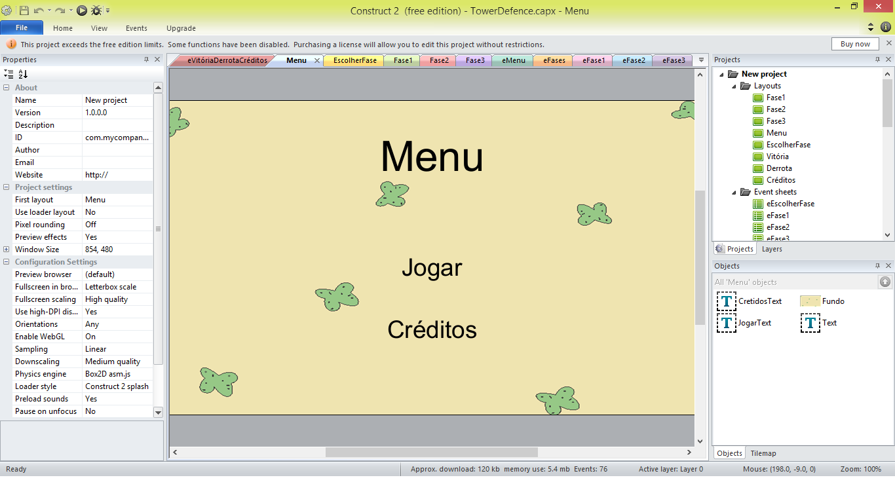
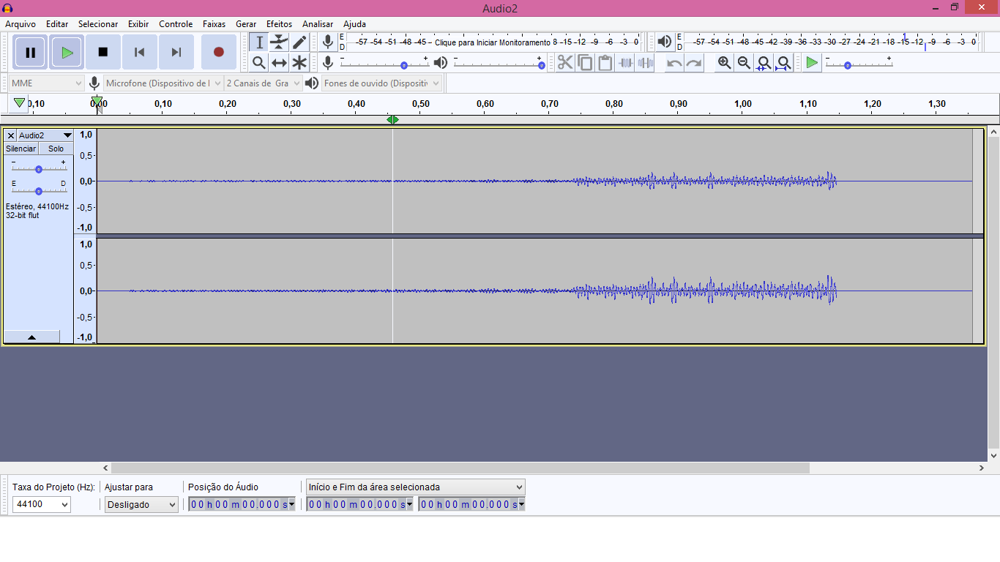
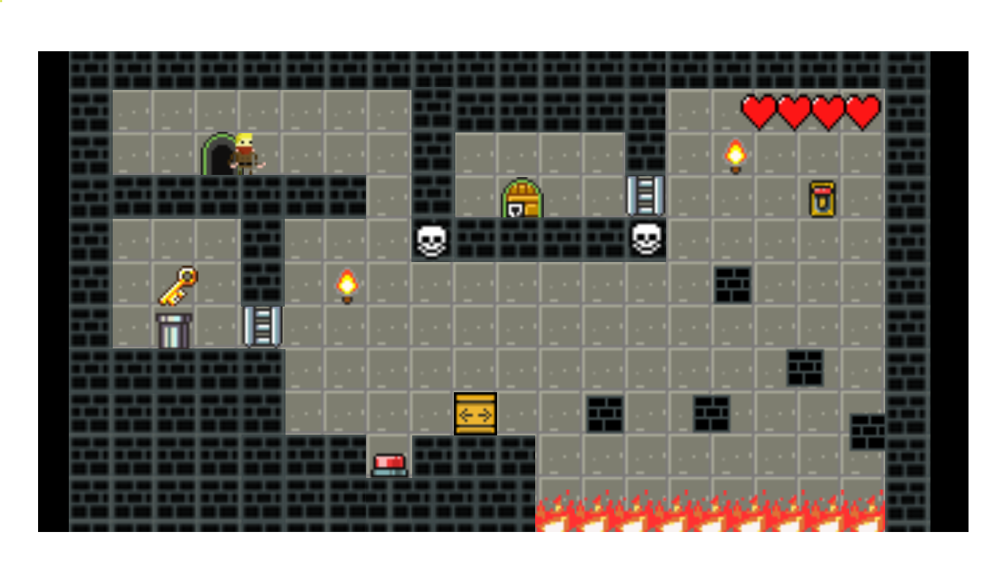
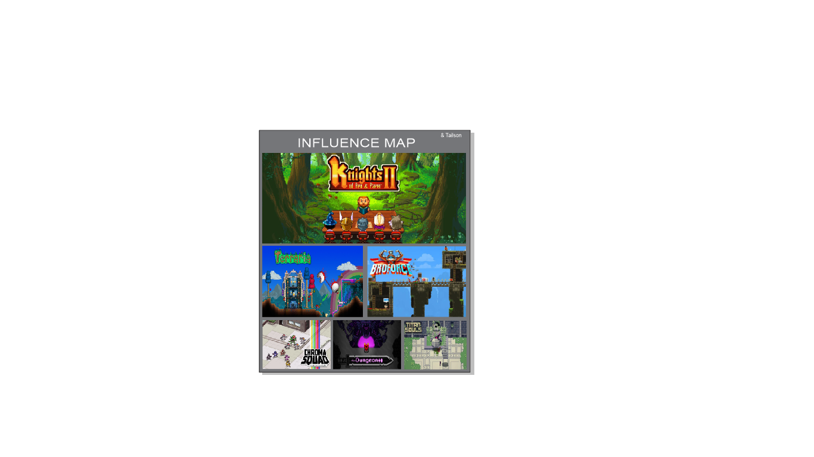

---
layout: default
---  
**PORTIFÓLIO**  

# Quem sou eu

 Olá! Me chamo Tailson Ferreira.   
Sou estudante do IFRN/Campus Ceará-Mirim, do curso técnico em Programação de Jogos Digitais.   
  
**VEM CONHECER MEUS TRABALHOS**
# Citação  

**Nada é permanente, exceto a mudança.**   
(Heráclito de Éfeso)
# Informações pessoais

Facebook: Tailson Ferreira   
Instagram: @_tailson.f  
Email: Tayllssonwer@gmail.com
# Games

[JOGO 1: OFICINA - DRACUL](https://tayllson.github.io/Dracul1/)     
[JOGO 2: OFICINA - ADVENTURIRUNNER](https://tayllson.github.io/AdventuriRunner/)  
[JOGO 3: OFICINA - MUNDOROBÔ](https://tayllson.github.io/MundoRob%C3%B4/) 

# Artes

 

# Apresentações

* Jogo 1 - Dracul - Ele é um jogo de plataforma e jogamos em PC. Dracul conta a história de um vámpiro que está querendo voltar para seu castelo, mas antes de completar seu objetivo, ele precisa passar por obstáculos, coletar 5 chaves e tudo isso antes que o tempo acabe ou então esse será seu FIM. 

* Jogo 2 - Adventuri Runner - Esse é um jogo Mobile. Adventuri Runner é um jogo especialmente para celulares, pois foi pensado para esse tipo de jogo a utilização de smartfone que vem crescendo fortemente no mercado de jogos. A pequena garota, está sempre em busca de aventuras, por isso que criei um jogo Runner em que a garota deverá coletar o máximo possível de moedas e pergaminhos seguindo sempre em frente.

* Jogo 3 - Mundo Robô - Jogamos em PC. Mundo Robô é um jogo de tiro, onde máquinas estão lutando para poder se manter. O jogo é construído em pixel art, ele se passa em um mundo chamando PixelTron. Antes de acabar com toda sua munição, pense bem, para abrir as portas você precisará de bala e os inimigos tomam vantagem quando você não tem munição.

# Projetos

 * Gameterapia/ uma forma de unir jogos digitais a pacientes acometidos pelo Acidente fascular encefálico(AVE) - Esse projeto surgiu a partir de uma atividade que foi passada em sala de aula pela professora de biologia, Videanny Videnov. Para desenvolver o projeto, meu grupo e eu, optamos em acrescentar o curso de jogos no projeto, por isso do termo " Unir jogos digitais". A pesquisa foi feita com idosos do asilo são vincente de Paulo em Ceará-Mirim/RN. O desenvolvmento desse projeto é analisar jogos digitais e consoles para utilizar-los como Gameterapia em pessoas que sofreram o AVE. Além disso, é trazer uma boa condição de vida para pessoas acometidas de uma forma mais ludica. O projeto foi credenciado à 32ª edição da Mostra Brasileira de Ciência e Tecnologia - MOSTRATEC, que acontece em Novo Hamburgo (RS) ainda no mês de outubro.
 
 
 
 * Projeto integrador - É um jogo digital(Tower Defende), vinculado com a materia de biologia. Tratamos de unir o estilo de jogo a uma área estudada pela disciplina de biologia, daí optamos por fazer uma espécie de agregação envolvendo o game a vírus e bactérias. O game consiste em defender o organismo de determinadas bactérias ou vírus. Tower Defende (em português, defesas de torres), tem como objetivo impedir que inimigos percorram por um mapa por meio de armadilhas para atrasá-los e torres que atiram neles enquanto passam.    
 
 
 
 
 # Trabalhos desenvolvidos   
 
 * Mockup de Jogo - Juntamente com meu colega, desenvolvemos um Mockup de um jogo e também um aúdio. Todas as artes foram feitas em Pixel, seu desenvolvimento foi no construct 2 e a criação do aúdio no audacity.  
 
   Link para acessar o Muckup: (https://jefferson141.github.io/Mockup/)
 
   
 
 
 * Mapa de Influência - Para ajudar na criação de novos jogos e manter a criatividade no desenvolvimento de jogos, os alunos de PJD3M, teriam que criar seu próprio mata de influência. Serviu como estimulo para ampliar a criação de novos jogos.  
 
 
 

